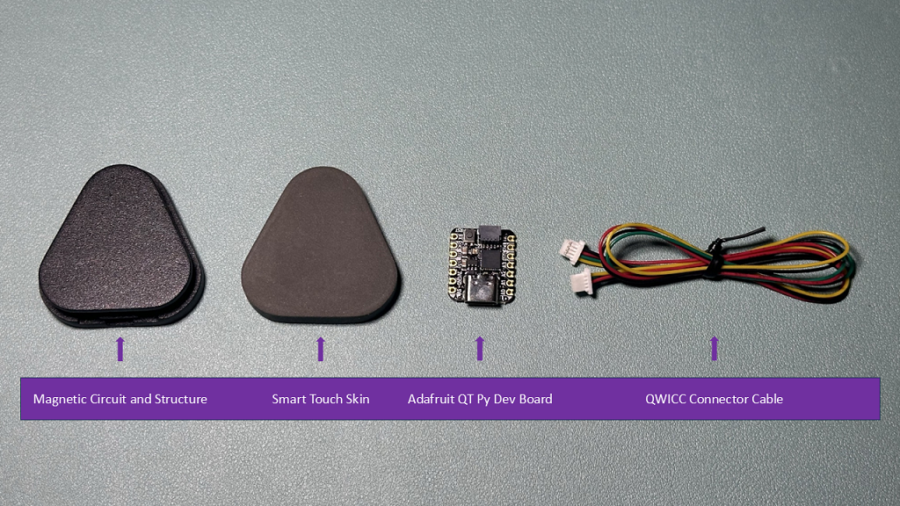
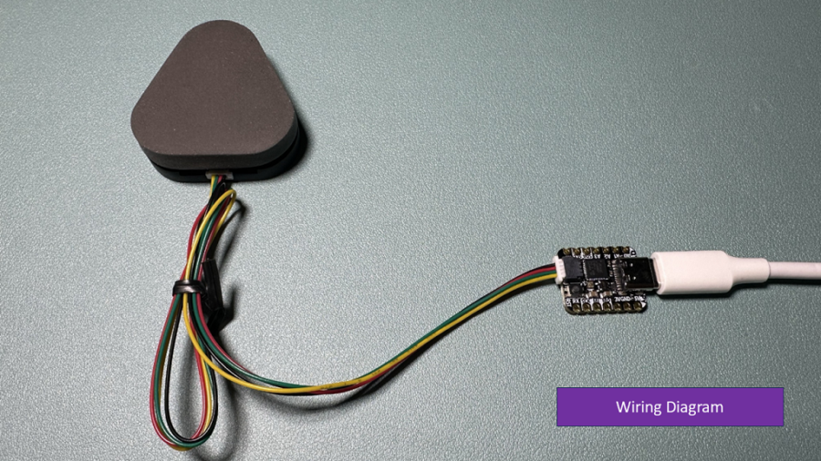
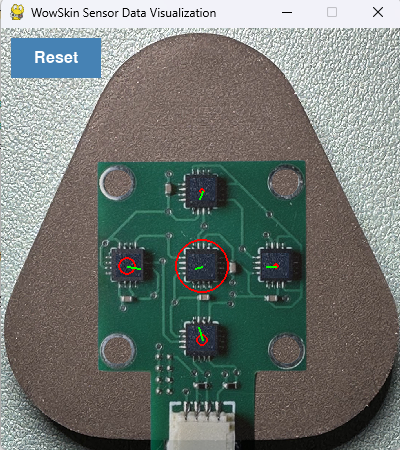
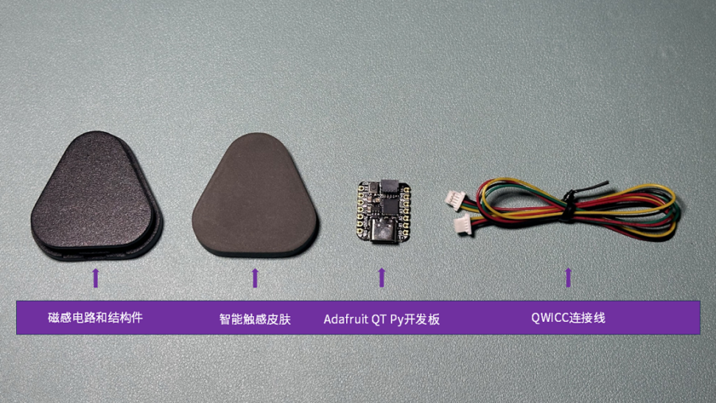

# WowSkin

 [English](#english-version) | [中文](#中文版)

---

## English Version

> ⚠️ This project is a UI-based extension of [AnySkin](https://github.com/raunaqbhirangi/anyskin), adding only a graphical **Reset** button. All core sensor processing logic is inherited from the original AnySkin project. For general use, we recommend using the official version.

## Hardware

WowSkin hardware is based on the open-source magnetic tactile design from the [AnySkin](https://github.com/raunaqbhirangi/anyskin) project. It is mass-produced for educational, demonstration, and research purposes.

> To learn more about the hardware's principles and background, please visit the [AnySkin official page](https://any-skin.github.io/).

If you are interested in WowSkin hardware, please contact us or visit our official stores:

📍 [Taobao Store (China)](https://item.taobao.com/item.htm?ft=t&id=863972140022)
📍 [Official Store (International)](https://shop.wowrobo.com/products/enhanced-anyskin-premium-crafted-editionwowskin)

## Requirements

* Python 3.8 or higher

---

## **Installation**

1. **Clone the repository**
   Run the following command in your terminal:

   ```bash
   git clone https://github.com/WowRobo-Robotics/WowSkin.git
   ```

2. **Enter the project directory**

   ```bash
   cd WowSkin
   ```

3. **Create and activate a virtual environment (recommended)**

   * **Windows(CMD recommended)**:

     ```bash
     python -m venv .venv
     .venv\Scripts\activate.bat
     ```
   * **macOS / Linux**:

     ```bash
     python3 -m venv .venv
     source .venv/bin/activate
     ```

4. **Install dependencies**

   ```bash
   pip install -r requirements.txt
   ```

---

## **Quick Start**

1. **Hardware connection**  

2. **Find your COM port**

   * Identify the serial port your microcontroller is connected to:

     * **Linux**: `ls /dev/ | grep -e ACM -e USB` (e.g. `/dev/ttyACM0` or `/dev/ttyUSB0`)
     * **MacOS**: `ls /dev/ | grep cu.usb` (e.g. `cu.usbmodem*`)
     * **Windows**: Check "Ports (COM & LPT)" in Device Manager, e.g. `COM3`

3. **Run the visualizer**

   ```bash
   python wowskin_viz.py -p <port>
   ```

   Replace `<port>` with the actual port from step 2.

   #### Examples:

   * **Windows**:

     ```bash
     python wowskin_viz.py -p COM3
     ```
   * **Linux**:

     ```bash
     python wowskin_viz.py -p /dev/ttyACM0
     ```

4. **Recalibrate baseline**
   Click the **Reset** button in the UI to recalibrate the zero point. This is more intuitive and doesn't depend on keyboard focus.

   

---

## **Contact Us**

If you have any questions or need assistance, feel free to reach out:

* **WeChat**: xiaonian52 (please mention "WowSkin inquiry")
* **Discord**: [Join our community](https://discord.gg/dhTGTvJQC4)

---

## **License**

WowSkin uses the [MIT License](LICENSE) for its open-source software components.

---

## 中文版

> ⚠️ 本项目基于 [AnySkin](https://github.com/raunaqbhirangi/anyskin) 项目，仅增加了一个图形化 Reset 按钮。核心算法全部来自原始 AnySkin 项目，推荐用户根据实际需求优先选择使用官方版本。

## 硬件

WowSkin 硬件基于 [AnySkin](https://github.com/raunaqbhirangi/anyskin) 项目的磁性感知方案，进行了批量化生产，适用于教学演示与研究场景。

> 如果您希望了解此类磁性感知硬件的设计原理与背景，请参考原作者发布的 [AnySkin 项目主页](https://any-skin.github.io/)。

如果您对 WowSkin 硬件感兴趣，请联系我们或访问我们的官方商店。

📍 [淘宝官方店铺（中文版）](https://item.taobao.com/item.htm?ft=t&id=863972140022)
📍 [官方商店（海外版）](https://shop.wowrobo.com/products/enhanced-anyskin-premium-crafted-editionwowskin)

## 环境要求

* Python 3.8 或更高版本

---

## **安装方法**

1. **克隆此仓库**
   在终端中运行以下命令克隆项目：

   ```bash
   git clone https://github.com/WowRobo-Robotics/WowSkin.git
   ```

2. **进入项目目录**
   在克隆完成后，进入项目目录：

   ```bash
   cd WowSkin
   ```

3. **创建并启用虚拟环境 (推荐)**

   * **Windows(建议使用 CMD 命令行)**:

     ```bash
     python -m venv .venv
     .venv\Scripts\activate.bat
     ```
   * **macOS / Linux**:

     ```bash
     python3 -m venv .venv
     source .venv/bin/activate
     ```

4. **安装依赖**

   ```bash
   pip install -r requirements.txt
   ```

---

## **快速使用指南**

1. **硬件连接**  

2. **检测 COM 端口**

   * 确认您的微控制器连接到的设备路径（`<port>`），具体步骤如下：

     * **Linux**: `ls /dev/ | grep -e ACM -e USB`（一般为 `/dev/ttyACM0` 或 `/dev/ttyUSB0`）
     * **MacOS**: `ls /dev/ | grep cu.usb`（一般为 `cu.usbmodem*`）
     * **Windows**: 打开设备管理器并查看 "端口(COM & LPT)"，如 `COM3`

3. **运行可视化工具**

   ```bash
   python wowskin_viz.py -p <port>
   ```

   替换 `<port>` 为您在上一步找到的实际端口号。

   #### 示例：

   * **Windows 示例**：

     ```bash
     python wowskin_viz.py -p COM3
     ```
   * **Linux 示例**：

     ```bash
     python wowskin_viz.py -p /dev/ttyACM0
     ```

4. **重新校准零点**
   在可视化窗口中点击 **Reset** 按钮以重新校准零点。这种方式更直观，不受窗口激活状态限制。

   

---

## **联系我们**

如果您有任何问题或需要帮助，可以通过以下方式联系我们：

* **微信号**：xiaonian52，添加时请注明“咨询WowSkin”

---

## **许可证**

WowSkin 使用 [MIT License](LICENSE) 许可证开源软件部分。
